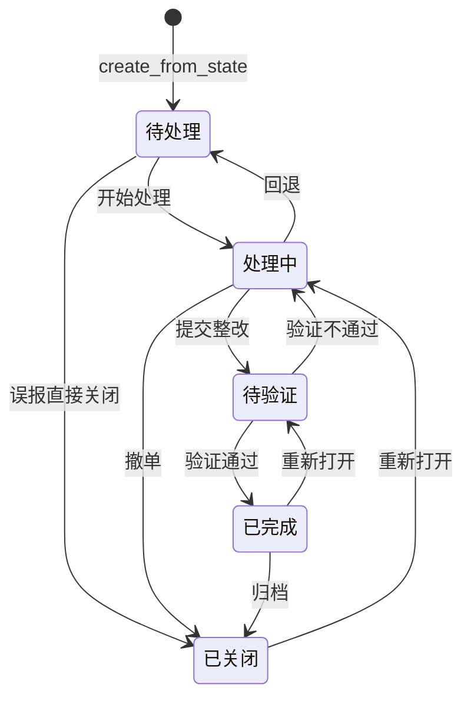

# RobotOps AI · 机器人运营智能分析平台

> **上传数据 → 指标 / 异常 → AI 解读 → 历史案例 → 整改建议 → 跟踪闭环**
>
> 一站式「机器人 / 设备运营」数据分析与问题管理平台。无需 LLM 也能跑通分析；
> 接入 DeepSeek 后自动获得诊断、建议与可解释的报告。

[](#)
[](#)
[](#-架构概览)
[](LICENSE)
[](#-测试)

---

## 目录

- [项目简介](#-项目简介)
- [核心特性](#-核心特性)
- [架构概览](#-架构概览)
- [目录结构](#-目录结构)
- [快速上手（5 分钟）](#-快速上手5-分钟)
- [使用指南](#-使用指南)
  - [命令行（CLI）](#命令行cli)
  - [可视化界面（Streamlit）](#可视化界面streamlit)
  - [Python API](#python-api)
- [核心模块详解](#-核心模块详解)
  - [Phase 1 · 数据分析（确定性）](#phase-1--数据分析确定性)
  - [Phase 2 · DeepSeek Agent](#phase-2--deepseek-agent)
  - [Phase 3 · 知识库 RAG](#phase-3--知识库-rag)
  - [Phase 4 · 多 Agent 工作流](#phase-4--多-agent-工作流)
  - [Phase 5 · Streamlit 可视化](#phase-5--streamlit-可视化)
  - [Phase 6 · 运营问题闭环](#phase-6--运营问题闭环)
- [数据模型与输入](#-数据模型与输入)
- [指标口径](#-指标口径)
- [异常识别规则](#-异常识别规则)
- [报告输出](#-报告输出)
- [知识库（向量检索）](#-知识库向量检索)
- [配置（.env 与阈值）](#-配置env-与阈值)
- [测试](#-测试)
- [路线图](#-路线图)
- [FAQ](#-faq)
- [安全与合规](#-安全与合规)
- [贡献指南](#-贡献指南)
- [许可证](#-许可证)

---

## 项目简介

**RobotOps AI** 是面向「机器人 / 智能设备运营」场景的数据分析与问题管理平台。它把日常运营产生的 Excel / CSV 数据，自动变成可执行的运营建议和可跟踪的整改任务。

| 你拿到的是什么 | 解决的痛点 |
| --- | --- |
| 6 项核心指标 + 项目 / 机器人两个维度的汇总 | 每天看 Excel 表格找问题，效率低、易遗漏 |
| 按阈值自动识别的「故障率 / 满意度 / 运行率 / 节降率」异常 | 异常发现滞后，等用户投诉才知道 |
| DeepSeek 生成的中文诊断 + 整改建议 | 现场工程师不会写分析报告 |
| RAG 检索历史案例 | 老员工的经验留不住，新人重复踩坑 |
| 「分析 → 整改 → 验证 → 关闭」的工单闭环 | 异常只停留在报表里，没有责任人、没有验证 |
| Streamlit 可视化界面 | 给非技术同事用，原生 UI 即可上手 |

项目按 6 个阶段递进，每个阶段都「可独立运行」：

```
Phase 1（确定性 Pandas） → Phase 2（DeepSeek） → Phase 3（RAG） →
Phase 4（多 Agent 工作流） → Phase 5（Streamlit UI） → Phase 6（问题闭环）
```

---

## 核心特性

- ✅ **零依赖即可用**：Phase 1 只需要 pandas / numpy / openpyxl，无需任何 API Key
- ✅ **数据格式兼容**：Excel（xlsx/xlsm/xls）/ CSV；列名带同义词别名（"故障数"/"fault_count" 等）
- ✅ **4 条异常规则** + 严重程度分级（高 / 中 / 低），覆盖机器人运营最常见的 4 类痛点
- ✅ **DeepSeek 集成**：基于 OpenAI 兼容接口；HTTP 用标准库 `urllib`，无三方 HTTP 依赖
- ✅ **本地 RAG**：自研哈希 Embedding，**不下载任何预训练模型**，离线稳定运行
- ✅ **LangGraph 多 Agent**：Data Analysis → Abnormal Check → Diagnosis → RAG → Recommendation → Report
- ✅ **闭环工单**：异常 → 创建问题 → 整改 → 重新上传数据 → 自动对比验证 → 关闭
- ✅ **离线模板**：所有 AI 阶段都提供「不调用大模型」的降级路径，便于本地调试与 CI
- ✅ **24 个测试文件**：覆盖数据 / 指标 / 异常 / Agent / RAG / Streamlit / Issue 全链路
- ✅ **本地持久化**：运营问题存 SQLite（WAL 模式），向量库存 ChromaDB，零外部服务

---

## 架构概览

```mermaid
flowchart LR
    subgraph 输入
        A[Excel/CSV 运营数据]
        K[knowledge/*.md 历史案例]
    end

    subgraph Phase1["Phase 1 · Pandas（确定性）"]
        P1A[data_loader] --> P1B[data_cleaner]
        P1B --> P1C[metrics]
        P1C --> P1D[anomaly]
    end

    subgraph Phase2["Phase 2 · DeepSeek Agent"]
        P2[RobotOpsAnalysisAgent]
    end

    subgraph Phase3["Phase 3 · RAG（本地向量库）"]
        P3A[document_loader] --> P3B[hash Embedding]
        P3B --> P3C[ChromaDB]
    end

    subgraph Phase4["Phase 4 · LangGraph 工作流"]
        W1[Data Analysis Agent]
        W2{{Abnormal Check（程序判定）}}
        W3[Diagnosis Agent]
        W4[RAG Agent]
        W5[Recommendation Agent]
        W6[Report Agent]
    end

    subgraph Phase5["Phase 5 · Streamlit UI"]
        S1[分析工作台]
        S2[运营问题]
    end

    subgraph Phase6["Phase 6 · 闭环工单"]
        I1[IssueStore SQLite]
        I2[IssueService]
        I3[验证对比（按实际数据）]
    end

    A --> P1A
    P1D --> P2
    P1D --> W1
    K --> P3A
    P3C --> P2
    P3C --> W4
    W1 --> W2
    W2 -- 无异常 --> W6
    W2 -- 有异常 --> W3 --> W4 --> W5 --> W6
    P2 --> S1
    W6 --> S1
    S1 --> I2
    I2 --> I1
    S2 --> I2
    I2 --> I3 --> I1

    classDef phase1 fill:#e3f2fd,stroke:#1976d2
    classDef phase2 fill:#fff3e0,stroke:#f57c00
    classDef phase3 fill:#f3e5f5,stroke:#7b1fa2
    classDef phase4 fill:#e8f5e9,stroke:#388e3c
    classDef phase5 fill:#fce4ec,stroke:#c2185b
    classDef phase6 fill:#ede7f6,stroke:#5e35b1
    class P1A,P1B,P1C,P1D phase1
    class P2 phase2
    class P3A,P3B,P3C phase3
    class W1,W2,W3,W4,W5,W6 phase4
    class S1,S2 phase5
    class I1,I2,I3 phase6
```



**核心设计原则：**

1. **「是否异常」由程序判定**，大模型不参与判断，只负责"解释与建议"。
2. **Phase 1 是其他阶段的源数据**，所有后续阶段共用 `AnalysisResult` 结构。
3. **任何阶段都能降级**到无 LLM 模式，便于本地调试、CI、零成本体验。
4. **指标数值与改善幅度全部按实际数据计算**，不依赖大模型推断。

---

## 目录结构

```text
RobotOps AI/
├── main.py                 # Phase 2 CLI 入口（DeepSeek Agent）
├── run_analysis.py          # Phase 1 CLI 入口（Pandas 分析）
├── run_workflow.py         # Phase 4 CLI 入口（LangGraph 多 Agent）
├── requirements.txt        # 运行依赖（pandas/numpy/openpyxl/chromadb/langgraph/streamlit）
├── .env.example            # 环境变量示例
├── LICENSE                 # MIT
│
├── robotops/               # 核心库（Phase 1~3 + 6）
│   ├── config.py           # 路径、列定义、阈值（唯一来源）
│   ├── data_loader.py      # 读取 Excel/CSV + 列名别名
│   ├── data_cleaner.py     # 缺值/类型/边界/范围清洗
│   ├── metrics.py          # 6 项核心指标 + 项目汇总
│   ├── anomaly.py          # 4 条异常规则 + 严重程度
│   ├── pipeline.py         # 完整流水线（读取→清洗→指标→异常→导出）
│   ├── report.py           # 报告生成（Excel/CSV/JSON/Markdown）
│   ├── cli.py              # Phase 1 CLI
│   ├── llm/                # Phase 2 · DeepSeek 客户端
│   ├── rag/                # Phase 3 · RAG（ChromaDB + 哈希 Embedding）
│   ├── agent/              # Phase 2 · Agent 编排 + 载荷构造
│   └── issues/             # Phase 6 · 运营问题（SQLite + 业务逻辑）
│
├── app/                    # Phase 4 · 多 Agent 工作流（LangGraph）
│   ├── agents/             # data_analysis / diagnosis / rag_agent / recommendation / report
│   └── graph/              # 工作流编排 + 状态 + 日志
│
├── frontend/               # Phase 5 · Streamlit 可视化
│   ├── app.py              # 平台入口（侧边栏切换模块）
│   ├── ui_helpers.py       # 上传 / 预览 / 状态辅助
│   ├── issues_helpers.py   # 问题工单辅助
│   └── views/              # analysis.py / issues.py
│
├── tests/                  # 24 个测试文件（≈200 用例）
├── scripts/                # 演示数据生成 / 知识库构建 / API 自检
├── knowledge/              # Phase 3 · 案例库（17 篇 Markdown）
│   ├── equipment_fault/    #   设备故障 4 篇
│   ├── maintenance/        #   维保 4 篇
│   ├── operation/          #   运营 5 篇
│   └── satisfaction/       #   满意度 4 篇
│
├── data/
│   ├── raw/                # 原始数据（含 robot_operation_demo.xlsx）
│   ├── processed/          # 清洗后数据
│   ├── chroma/             # ChromaDB 索引（可重建）
│   └── issues.db           # SQLite（WAL 模式）运营问题库
│
└── output/                 # 默认输出目录
    ├── robot_ops_report.xlsx        # 主报告
    ├── robot_ops_report.md          # Markdown 报告
    ├── robot_ops_report_*.csv       # 维度表
    ├── ai_analysis.json / .md       # Phase 2 AI 分析结果
    ├── ai_input_payload.json        # 发送给大模型的载荷
    ├── workflow_*.json / .md        # Phase 4 工作流产物
    └── workflow.log                 # 工作流日志
```

---

## 快速上手（5 分钟）

### 1. 安装依赖

```bash
git clone <your-repo-url> robotops-ai
cd robotops-ai
python -m venv .venv
# Windows
.venv\Scripts\activate
# macOS / Linux
source .venv/bin/activate

python -m pip install -r requirements.txt
```

### 2. 跑通离线分析（无需 API Key）

```bash
# Phase 1：用演示数据跑完整流程
python run_analysis.py

# 查看产物
ls output/
# robot_ops_report.xlsx / .md / metrics.csv / anomalies.csv / ...
```

### 3.（可选）启用 AI 分析

```bash
cp .env.example .env
# 编辑 .env，把 DEEPSEEK_API_KEY=sk-xxx 替换为真实密钥

# Phase 2：Pandas + DeepSeek
python main.py

# Phase 3：包含 RAG 检索历史案例
python main.py --search "巡检机器人漏检怎么处理"

# Phase 4：LangGraph 多 Agent
python run_workflow.py

# Phase 4 离线模板（不调用 LLM）
python run_workflow.py --no-llm
```

### 4.（可选）启动可视化界面

```bash
streamlit run frontend/app.py
# 浏览器打开 http://localhost:8501
```

> 演示数据：`data/raw/robot_operation_demo.xlsx` 已包含 6 类机器人 × 多项目 × 多日运营数据，
> 用于把每一条命令都跑通。

---

## 使用指南

### 命令行（CLI）

| 命令 | 说明 |
| --- | --- |
| `python run_analysis.py` | Phase 1：Pandas 分析 + 报告导出（无需 API Key） |
| `python main.py` | Phase 1 + 2：Pandas + DeepSeek 分析 |
| `python main.py --dry-run` | 只生成并打印「将要发给大模型」的结构化载荷，不调用 API |
| `python main.py --show-prompt` | 打印实际发送的 Prompt（system + user） |
| `python main.py --json` | 以 JSON 形式输出 AI 分析结果 |
| `python main.py --rebuild-knowledge` | 重建 RAG 知识库索引 |
| `python main.py --rag-status` | 查看知识库索引状态 |
| `python main.py --search "<query>"` | 仅检索知识库 Top-K 案例 |
| `python run_workflow.py` | Phase 4：LangGraph 多 Agent 工作流 |
| `python run_workflow.py --no-llm` | 离线模板模式（不调用 LLM） |
| `python run_workflow.py --no-rag` | 关闭 RAG 检索 |
| `python run_workflow.py --json` | 以 JSON 输出工作流状态 |
| `python run_analysis.py --help` | 查看完整参数 |

**常用参数**（Phase 1/2/4 均支持）：

| 参数 | 默认值 | 说明 |
| --- | --- | --- |
| `-d / --data PATH` | 演示数据 | 数据文件路径 |
| `-o / --output DIR` | `output/` | 结果输出目录 |
| `--sheet NAME` | 第一个 sheet | Excel 工作表 |
| `--encoding ENC` | 自动识别 | CSV 编码（如 `gbk`） |
| `--fault-rate-upper PCT` | `5.0` | 故障率上限阈值 |
| `--satisfaction-lower SCORE` | `85.0` | 满意度下限阈值 |
| `--uptime-rate-lower PCT` | `80.0` | 运行率下限阈值 |
| `--saving-rate-lower PCT` | `10.0` | 节降率下限阈值 |
| `--rag-top-k N` | `5` | RAG 检索 Top-K |
| `--rag-min-similarity F` | `0.35` | RAG 最低相似度阈值 |
| `--rag-max-cases N` | `6` | 最多注入提示词的案例数 |

### 可视化界面（Streamlit）

```bash
streamlit run frontend/app.py
```

界面包含两个模块（侧边栏切换）：

- **分析工作台** —— 上传 Excel / CSV → 调阈值 → 启用 / 关闭 AI → 运行分析 → 创建运营问题
- **运营问题** —— 问题列表 / 详情 / 处理记录 / 状态流转 / 整改效果验证 / 关闭

### Python API

```python
from robotops.pipeline import run_analysis
from robotops.config import AnomalyThresholds

# Phase 1：纯 Pandas 分析
result = run_analysis(
    data_path="data/raw/robot_operation_demo.xlsx",
    output_dir="output/",
    thresholds=AnomalyThresholds(fault_rate_upper=4.5, satisfaction_lower=88.0),
)
print(result.metrics_dict())
print(f"异常 {result.anomaly_count} 条")

# Phase 2：接入 DeepSeek
from robotops.agent.robot_ops_agent import RobotOpsAnalysisAgent
from robotops.llm.config import LLMConfig

llm_cfg = LLMConfig.from_env().validate(require_api_key=True)
agent = RobotOpsAnalysisAgent(config=llm_cfg)
result = agent.analyze(result)
print(result.analysis.to_markdown())
```

---

## 核心模块详解

### Phase 1 · 数据分析（确定性）

> **「指标怎么算、异常怎么判」全部由程序说了算，没有大模型参与判断。**

数据流：`数据加载 → 数据清洗 → 指标计算 → 异常识别 → 报告导出`

| 模块 | 职责 |
| --- | --- |
| `data_loader` | 读取 xlsx/xlsm/xls/csv；自动识别工作表；列名别名映射 |
| `data_cleaner` | 去除空行 / 修正类型 / 数值越界置空 / 重复时间戳 |
| `metrics` | 6 项核心指标 + 项目维度汇总 |
| `anomaly` | 4 条异常规则 + 严重程度分级 |
| `pipeline` | 把上述串成一条可复用的流水线 |
| `report` | 导出 Excel / CSV / JSON / Markdown |

### Phase 2 · DeepSeek Agent

> **原始 Excel 不会直接交给大模型。** 程序先算出结构化结果，再把「载荷 + 历史案例」发给 DeepSeek。

```text
Phase 1 输出（AnalysisResult）
        ↓
构造 Agent 输入载荷（payload）
        ↓
可选：RAG 检索 Top-K 历史案例
        ↓
DeepSeek（OpenAI 兼容接口，标准库 urllib）
        ↓
结构化分析结论（JSON + Markdown）
```

**关键设计：**
- 不向大模型传原始 Excel，只传指标和异常的「摘要」
- 单次调用，HTTP 标准库（无三方 HTTP 依赖）
- 指数退避重试（限流 / 服务端错误 / 超时 / 网络错误）
- `--dry-run` 模式可打印「将发送的载荷」而无需 API Key
- `--show-prompt` 模式可打印实际 Prompt 便于调试

### Phase 3 · 知识库 RAG

> **本地 Embedding，无需下载任何模型。** 文本通过 2~3 元字符 n-gram 哈希映射成 1024 维向量，ChromaDB 余弦相似度检索。

| 模块 | 职责 |
| --- | --- |
| `document_loader` | 解析 `knowledge/` 下 Markdown，按小节切块（最大 480 字符，重叠 120） |
| `embedding` | 哈希 Embedding（`local_hashing`，1024 维） |
| `vector_store` | ChromaDB 持久化（`data/chroma/`） |
| `retriever` | 检索 + 领域词过滤 + 相似度阈值 |

**案例库组织**（4 类 × 4~5 篇 = 17 篇）：

| 分类 | 用途 |
| --- | --- |
| `equipment_fault/` | 设备故障案例（电池 / 传感器 / 驱动 / 通讯） |
| `maintenance/` | 维保案例（计划保养 / 备件更换 / 巡检） |
| `operation/` | 运营案例（调度 / 路径 / 充电 / 排队） |
| `satisfaction/` | 满意度案例（投诉 / 噪音 / 响应） |

每篇案例必须包含：「问题 / 现象 / 可能原因 / 处理措施 / 处理结果」5 个段落。

### Phase 4 · 多 Agent 工作流

> **LangGraph 编排，「异常分支」由程序结果驱动**，大模型不参与判断。

```text
START
  → Data Analysis Agent（Phase 1）
  → Abnormal Check（程序判定，不调用 LLM）
      ├─ 无异常 → Report Agent → END
      └─ 有异常 → Diagnosis Agent → RAG Agent → Recommendation Agent → Report Agent → END
```

| Agent | 输入 | 输出 |
|---|---|---|
| Data Analysis Agent | 数据文件路径 / 阈值 | `AnalysisResult` |
| Abnormal Check | `AnalysisResult` | `has_anomalies`（布尔） |
| Diagnosis Agent | 异常项目摘要 | 异常原因诊断 |
| RAG Agent | 诊断文本 | Top-K 相关历史案例 |
| Recommendation Agent | 诊断 + 案例 | 整改建议清单 |
| Report Agent | 全流程产物 | 最终 Markdown 报告 |

**容错：单 Agent 失败不阻断**，失败原因写入 `state["errors"]`，其余 Agent 继续推进，最终报告降级生成。

### Phase 5 · Streamlit 可视化

- **单入口 + 侧边栏切换**：避免多页路由导致的控件重复创建问题
- **缓存上传数据**：相同文件不会重复解析（`@st.cache_data`）
- **离线降级**：未配置 API Key 时，AI 阶段自动使用离线模板
- **可调阈值**：故障率上限 / 满意度 / 运行率 / 节降率 全部可调

### Phase 6 · 运营问题闭环

> **发现 → 派单 → 处理 → 验证 → 关闭**，指标数值与改善幅度**全部按实际数据计算**，不依赖大模型推断。

**状态机：**



**问题编号格式**：`ISSUE-YYYYMM-NNN`（如 `ISSUE-202609-001`）

**整改效果验证**（无需 LLM）：

- 用户重新上传数据 → Phase 1 算出新指标
- `compute_metric_change` 按「|改后 - 改前| / |改前|」计算改善幅度
- 改善幅度 ≥ 10% → 「明显改善」；< 10% → 「轻微改善」；无改善 → 验证未通过

---

## 数据模型与输入

### 原始数据列定义

| 列名（中文） | 类型 | 必填 | 说明 |
| --- | --- | --- | --- |
| 日期 | datetime | ✅ | 运营记录的日期 |
| 项目名称 | str | ✅ | 项目维度（去重计数 = 项目数量） |
| 机器人ID | str | ✅ | 设备维度（去重计数 = 机器人数量） |
| 机器人类型 | str | ✅ | 清洁 / 巡检 / 安防巡逻 / 配送 / 消杀 / AGV搬运 |
| 运行时长 | float | ✅ | 单位：小时 |
| 计划运行时长 | float | ❌ | 单位：小时；缺失时按 24h 兜底 |
| 故障次数 | int | ✅ | 累计故障次数 |
| 巡检次数 | int | ✅ | 累计巡检次数 |
| 维修次数 | int | ✅ | 累计维修次数 |
| 用户满意度 | float | ✅ | 0~100 分 |
| 运营成本 | float | ✅ | 单位：元 |
| 节降率 | float | ✅ | -100~100（%） |

> 列名同义词自动映射，详见 [`robotops/config.py → COLUMN_ALIASES`](robotops/config.py)。
> 缺失必填列会在控制台给出明确提示。

### 支持的文件格式

- Excel：`.xlsx` / `.xlsm` / `.xls`（自动识别第一个非空 Sheet）
- CSV：自动识别 `utf-8` / `utf-8-sig` / `gbk` / `gb18030`

---

## 指标口径

| 指标 | 口径 |
| --- | --- |
| 项目数量 | 对「项目名称」去重计数 |
| 机器人数量 | 对「机器人ID」去重计数 |
| 平均运行时长 | 清洗后记录的「运行时长」算术平均值（小时） |
| 故障率 | **总故障次数 / 总巡检次数 × 100%** |
| 平均满意度 | 有效「用户满意度」记录的算术平均值（分） |
| 总运营成本 | 有效「运营成本」记录的求和（元） |
| 平均节降率 | 有效「节降率」记录的算术平均值（%） |
| 运行率 | **运行时长 / 计划运行时长 × 100%**（派生列） |

> 均值与求和都会自动跳过空值（如满意度越界被置空的记录不会拉低平均值）。

---

## 异常识别规则

| 规则 | 阈值（默认） | 单位 | 判定粒度 |
| --- | --- | --- | --- |
| 故障率 > 阈值 | 5.0 | % | 「机器人 + 分析周期」累计 |
| 用户满意度 < 阈值 | 85.0 | 分 | 逐条记录 |
| 运行率 < 阈值 | 80.0 | % | 逐条记录 |
| 节降率 < 阈值 | 10.0 | % | 逐条记录 |

**严重程度分级**（偏差幅度 = |实际值 - 阈值| / |阈值|）：

- 偏差 ≥ 50% → **高**
- 偏差 ≥ 20% → **中**
- 其余 → **低**

**故障率判定粒度说明**：故障率是比率型指标，单日样本过小（1 次故障 / 8 次巡检 = 12.5%）会让阈值失去区分度，因此默认按「机器人 + 周期」累计判定。如需更严格的判定，可通过参数切换为 `record`（逐条）。

判定指标为空的记录（例如巡检次数为 0 导致故障率无法计算）不会命中规则，但会在「清洗问题清单」中体现，避免被静默忽略。

---

## 报告输出

`output/` 目录默认产物：

| 文件 | 内容 |
| --- | --- |
| `robot_ops_report.xlsx` | 主报告（多 Sheet：核心指标 / 项目汇总 / 异常清单 / 清洗问题） |
| `robot_ops_report.md` | Markdown 报告（含核心指标 / 项目汇总 / 异常 / 数据健康度） |
| `robot_ops_report_metrics.csv` / `.json` | 核心指标 |
| `robot_ops_report_project_summary.csv` | 项目维度汇总 |
| `robot_ops_report_anomalies.csv` | 异常清单（含严重程度） |
| `robot_ops_report_cleaning_issues.csv` | 数据清洗问题清单 |
| `ai_analysis.json` / `.md` | Phase 2 大模型分析结果 |
| `ai_input_payload.json` | 实际发给大模型的结构化载荷 |
| `ai_rag_retrieval.json` | Phase 3 RAG 检索结果（命中案例 + 相似度） |
| `workflow_report.md` | Phase 4 多 Agent 工作流最终报告 |
| `workflow_state.json` | Phase 4 工作流完整状态（可重放） |
| `workflow_steps.json` | Phase 4 各阶段时间线 |
| `workflow.log` | Phase 4 工作流日志 |
| `ui_uploads/` | Streamlit 上传的文件副本 |

---

## 知识库（向量检索）

```bash
# 重建知识库索引
python main.py --rebuild-knowledge

# 查看索引状态
python main.py --rag-status

# 仅检索（不调用大模型）
python main.py --search "巡检机器人漏检怎么处理"
```

**关键参数**（可在 `.env` 中覆盖）：

| 环境变量 | 默认值 | 说明 |
| --- | --- | --- |
| `ROBOTOPS_KNOWLEDGE_DIR` | `knowledge/` | 案例库目录 |
| `ROBOTOPS_CHROMA_DIR` | `data/chroma` | 向量库持久化目录 |
| `ROBOTOPS_RAG_TOP_K` | `5` | 检索返回案例数 |
| `ROBOTOPS_RAG_MAX_CASES` | `6` | 注入提示词的案例数 |
| `ROBOTOPS_RAG_MIN_SIMILARITY` | `0.35` | 最低相似度阈值 |
| `ROBOTOPS_EMBEDDING_BACKEND` | `local_hashing` | 固定本地哈希方案 |

> `data/chroma/` 已加入 `.gitignore`，可随时重建。
> 案例文档必须包含「问题 / 现象 / 可能原因 / 处理措施 / 处理结果」5 个段落，否则会被跳过。

---

## 配置（.env 与阈值）

### `.env` 必填项

```bash
DEEPSEEK_API_KEY=sk-请替换为你的真实密钥
```

> 从 [platform.deepseek.com](https://platform.deepseek.com/) 获取。
> `.env` 已被 `.gitignore` 忽略，**严禁**把真实密钥提交到 Git。

### 完整配置项

详见 [`.env.example`](.env.example)，分组包括：

- **DeepSeek**：`DEEPSEEK_API_KEY` / `BASE_URL` / `MODEL` / `TIMEOUT` / `MAX_RETRIES` / `TEMPERATURE` / `MAX_TOKENS` / `LOG_LEVEL`
- **RAG**：`ROBOTOPS_KNOWLEDGE_DIR` / `CHROMA_DIR` / `TOP_K` / `MAX_CASES` / `MIN_SIMILARITY` / `EMBEDDING_BACKEND` 等
- **Issues**：`ROBOTOPS_ISSUES_DB`（SQLite 路径，可选）

### 阈值调整

两种方式：

1. **命令行参数**（单次生效）

   ```bash
   python run_analysis.py --fault-rate-upper 4.5 --satisfaction-lower 88
   ```

2. **改代码默认值**（永久生效）

   编辑 [`robotops/config.py → AnomalyThresholds`](robotops/config.py)。

---

## 测试

```bash
# 安装测试依赖（如果尚未安装）
python -m pip install pytest

# 跑全部测试
python -m pytest tests/ -v

# 单文件
python -m pytest tests/test_pipeline.py -v

# 按名称过滤
python -m pytest tests/ -k "anomaly or cleaner"
```

**测试覆盖（24 个文件）**：

| 模块 | 测试文件 |
| --- | --- |
| 数据加载 | `test_data_loader.py` |
| 数据清洗 | `test_data_cleaner.py` |
| 指标 | `test_metrics.py` |
| 异常 | `test_anomaly.py` |
| 流水线 | `test_pipeline.py` |
| DeepSeek 客户端 / 配置 / Schema | `test_deepseek_client.py` / `test_llm_config.py` / `test_ai_schema.py` |
| 环境变量加载 | `test_env_loader.py` |
| Agent 载荷 / Agent | `test_agent_payload.py` / `test_agent.py` |
| RAG 文档 / Embedding / Retriever | `test_rag_document_loader.py` / `test_rag_embedding.py` / `test_rag_retriever.py` |
| RAG Agent | `test_rag_agent.py` |
| 工作流 / CLI | `test_workflow.py` / `test_workflow_cli.py` |
| 主 CLI | `test_main_cli.py` |
| 前端辅助 / 前端应用 | `test_frontend_helpers.py` / `test_frontend_app.py` |
| 运营问题 / 页面 | `test_issues.py` / `test_issues_page.py` |

---

## 路线图

| 状态 | 阶段 | 说明 |
| --- | --- | --- |
| ✅ | Phase 1 | Pandas 指标 + 异常识别 + 报告 |
| ✅ | Phase 2 | DeepSeek Agent + 结构化输出 |
| ✅ | Phase 3 | 本地 RAG + 哈希 Embedding + ChromaDB |
| ✅ | Phase 4 | LangGraph 多 Agent 工作流 |
| ✅ | Phase 5 | Streamlit 可视化界面 |
| ✅ | Phase 6 | 运营问题闭环（SQLite + 整改验证） |
| 🔜 | Phase 7 | 多项目横向基准（Benchmark） |
| 🔜 | Phase 8 | 计划任务 / 定时分析（cron + 邮件） |
| 💡 | - | 接入更多 LLM（OpenAI / 国产替代） |
| 💡 | - | 多租户 / 组织 / 权限管理 |
| 💡 | - | 数据源直连（数据库 / API） |

---

## FAQ

<details>
<summary><b>Q：没有 DeepSeek API Key 能跑吗？</b></summary>

可以。

- `python run_analysis.py`：纯 Pandas，无 LLM
- `python run_workflow.py --no-llm`：多 Agent 离线模板
- `python main.py --dry-run`：打印将发送给大模型的载荷，无需 Key
- Streamlit 界面：未配置 Key 时自动使用离线模板
</details>

<details>
<summary><b>Q：原始数据没有「计划运行时长」怎么办？</b></summary>

会按 `DEFAULT_PLANNED_HOURS = 24.0` 兜底（每机器人类型有预设值，详见 `config.PLANNED_HOURS_BY_TYPE`）。
如需自定义，直接在数据里加一列即可。
</details>

<details>
<summary><b>Q：知识库可以扩展吗？</b></summary>

可以。在 `knowledge/<分类>/` 下新增 `CASE-XXX-NNN.md`，文件包含「问题 / 现象 / 可能原因 / 处理措施 / 处理结果」5 个段落即可。
然后运行 `python main.py --rebuild-knowledge` 重建索引。
</details>

<details>
<summary><b>Q：故障率阈值 5% 是怎么定的？</b></summary>

默认值在 [`config.DEFAULT_THRESHOLDS`](robotops/config.py) 里集中管理，可直接修改或通过 CLI 覆盖。
</details>

<details>
<summary><b>Q：运营问题数据存在哪？</b></summary>

SQLite 数据库，默认 `data/issues.db`（WAL 模式）。
可通过环境变量 `ROBOTOPS_ISSUES_DB` 覆盖路径。
该文件已在 `.gitignore` 中，可随时删除重建。
</details>

<details>
<summary><b>Q：如何在 CI 里跑？</b></summary>

```bash
python -m pip install -r requirements.txt
python -m pytest tests/ -v
```

所有阶段都提供「离线 / 干跑」路径，CI 不消耗任何 LLM 额度。
</details>

<details>
<summary><b>Q：Streamlit 启动后页面乱码怎么办？</b></summary>

设置环境变量：

```bash
# Windows PowerShell
$env:PYTHONIOENCODING="utf-8"
streamlit run frontend/app.py
```
</details>

---

## 安全与合规

- **密钥管理**：API Key 仅通过 `.env` 注入，**代码中无任何硬编码密钥**；`.env` 已加入 `.gitignore`
- **本地优先**：所有数据（向量库 / SQLite / 输出文件）均存储在本地，无外部服务依赖
- **隐私保护**：发给大模型的只是「指标 + 异常摘要」，**原始 Excel 不会离开本机**
- **可审计**：工作流产物（`workflow_state.json` / `workflow_steps.json`）可重放，方便审计
- **可控**：任何 AI 阶段都可降级为离线模式，CI / 测试环境零成本

---

## 贡献指南

欢迎贡献！建议流程：

1. **Fork** 本仓库并创建分支：`feat/<short-name>`
2. **运行测试**：`python -m pytest tests/ -v`（保证现有用例全部通过）
3. **新增用例**：在 `tests/` 下对应模块补单测，覆盖关键边界
4. **遵循风格**：保持现有模块的命名 / 类型注解 / docstring 风格
5. **提交 PR**：写清楚「解决了什么问题 / 怎么解决的 / 测试覆盖了什么」

**模块边界约定**：

- `robotops/`：Phase 1~3 + 6 核心库，**禁止**直接依赖 `app/` 或 `frontend/`
- `app/`：Phase 4 多 Agent 工作流，可依赖 `robotops/`
- `frontend/`：Phase 5 UI，可依赖 `robotops/` + `app/`
- `scripts/`：开发 / 调试脚本

---

## 许可证

[MIT](LICENSE) © 2026 RobotOps AI Contributors